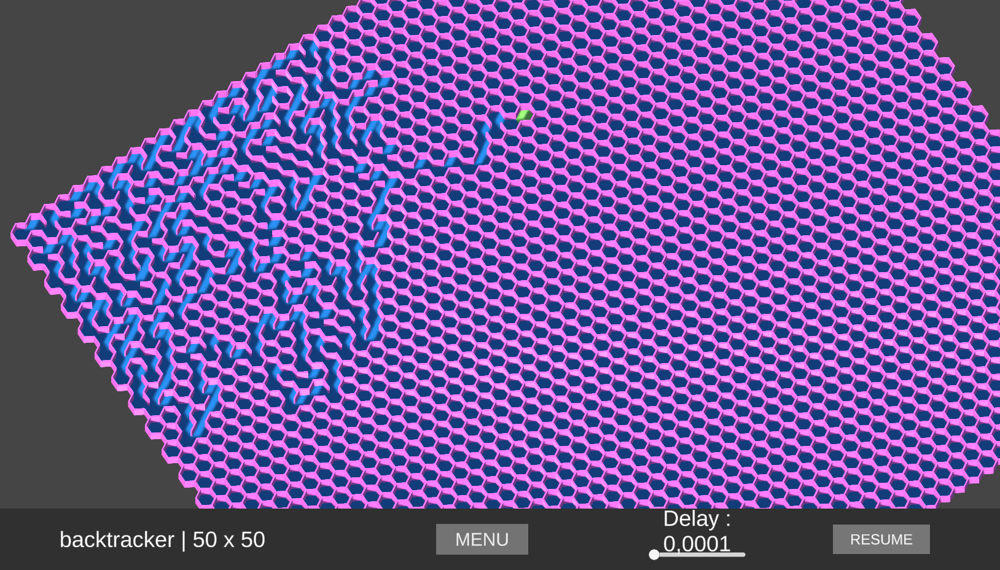
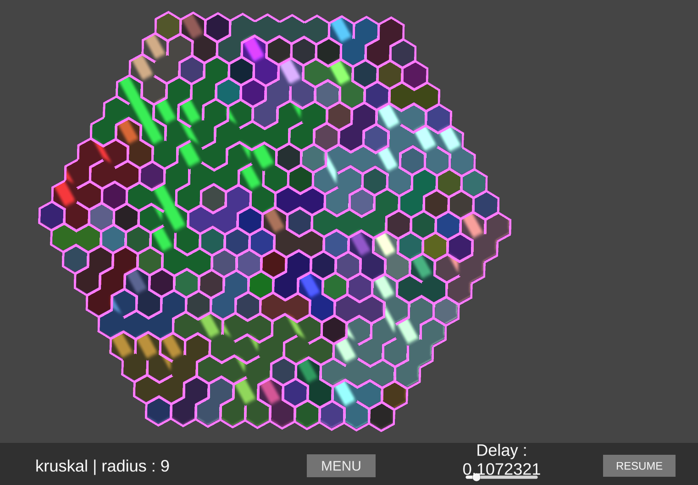
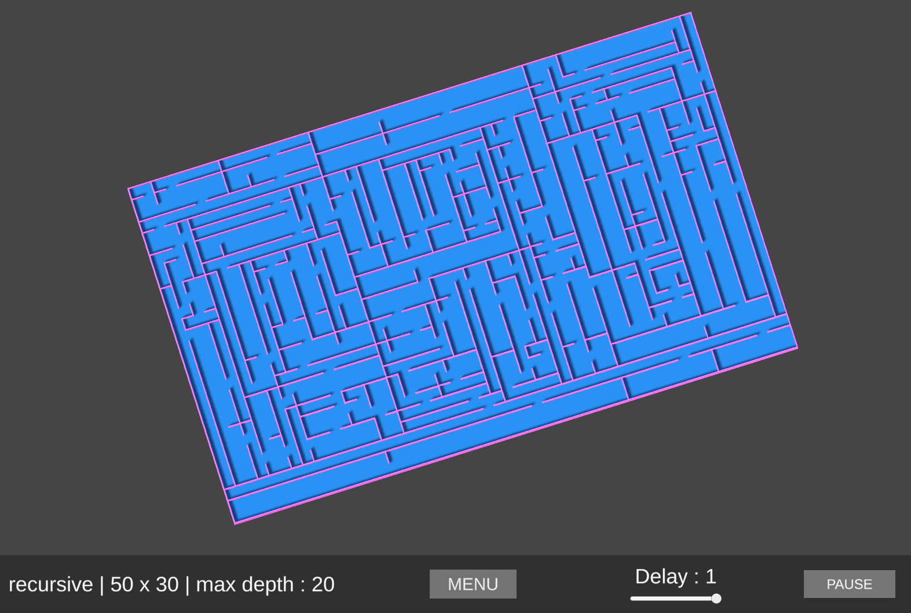

# Maze

A little experimentation with maze generation in Unity.

You can find the project documentation here :
https://b-bischoff.github.io/web/labyrinthes.html

Here is a list of the differents algorithms used : 

- Backtracker
- Kruskal
- Prim
- Recursive
- Better recursive (by Jamis Buck)

The mazes can be square or hexagonal shaped

Here are some photos of the results :

You will need Unity to open this project or you can download the compiled application with the site below :

https://b-bischoff.itch.io/maze
